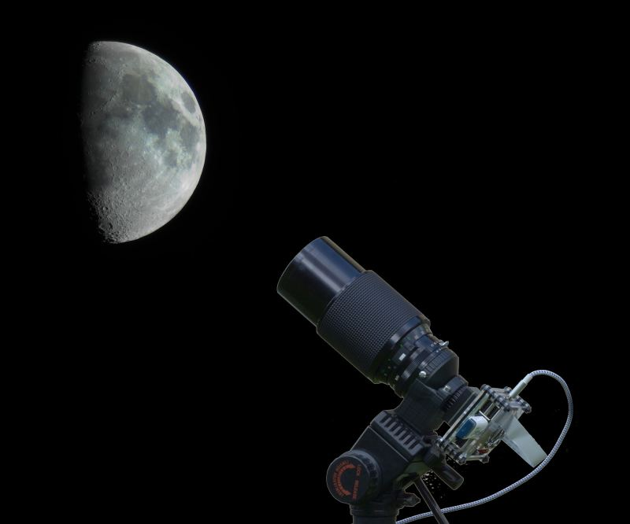

Maker Media GmbH

***

# Astrofotografie mit Pi und HQ-Kamera

### Die High-Quality-Kamera für den Raspberry Pi lässt sich mit unterschiedlichen Objektiven bestücken – unter anderem auch mit alten Foto-Objektiven aus der Analogzeit. Dank der HQ-Cam kann man so mit überschaubarem Budget und freier Software sogar in die Astrofotografie einsteigen. 

 

Hier finden Sie Skripte und die 3D-Druckvorlagen.

Den vollständigen Artikel mit der Bauanleitung gibt es in der [Make-Ausgabe 4/21 ab Seite 30](https://www.heise.de/select/make/2021/4/2108307234922752584). 

### 

